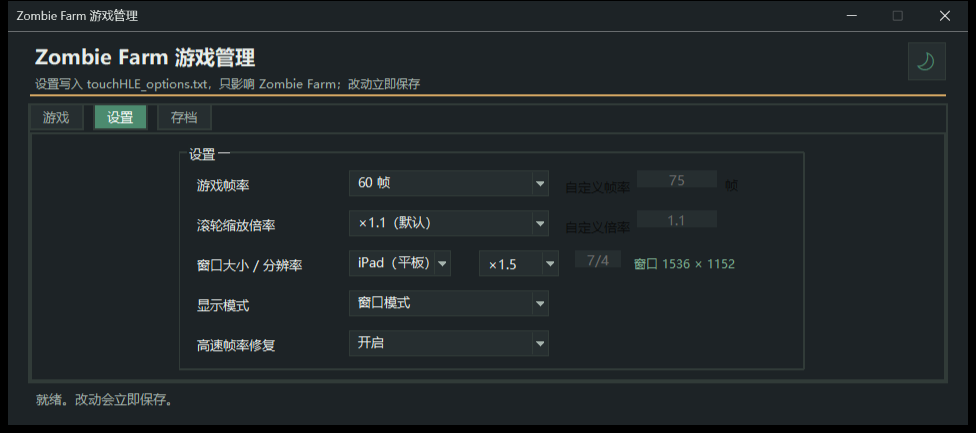
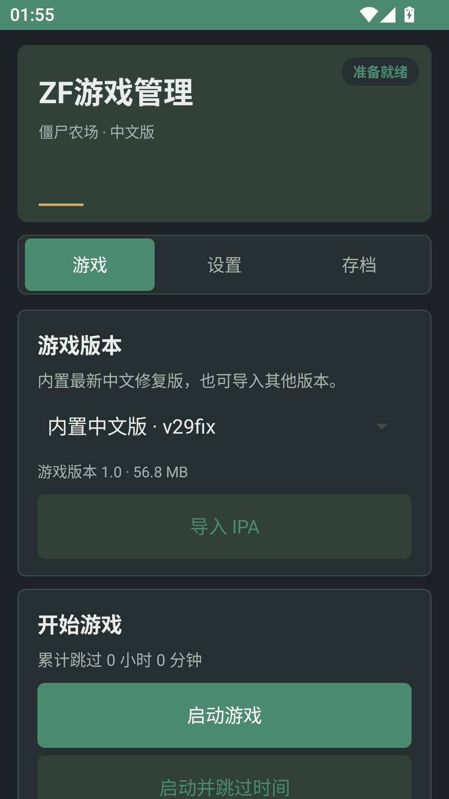

# Zombie Farm 中文版 · Windows / Android

**在 Windows PC 或 Android ARM64 设备上，运行修复并完整中文化的原版《僵尸农场》（Zombie Farm）。**

> **本文档（以及本仓库的多数文档）由 AI 生成**：内容是在实机取证、逐项验证的基础上写的，
> 但行文由 AI 整理，可能存在表述偏差或滞后。**技术结论以仓库里的脚本、报告与实测为准**；
> 发现与事实不符的地方，欢迎提 Issue 指正。

项目包含针对 Zombie Farm 修复的 [touchHLE](https://touchhle.org/) 模拟器、Windows 与 Android 管理器，
以及对游戏 IPA 的**等宽原地二进制补丁**（修崩溃、统一界面字号、修复中文本地化、修正排版）。

> 游戏本体是 2011 年前后的 iPhone 老游戏。**iPhone 原生分辨率是 480×320**；iPad 原生分辨率
> 是 **1024×768**，选择 iPad 并使用 ×1.5 倍率时，才会渲染为 **1536×1152**。此外还有 60 帧、
> 界面文字统一放大、中文不再缺字或乱码等修复。
>
> **想玩「现代化重制版」的话，那不是这个项目** —— 见下面的
> [想玩原版还是重制版](#想玩原版还是重制版)。
> 重制版（Reforged）原生是英文，**想玩中文的话，配我写的
> [汉化脚本](https://github.com/Ashena1017/zombie-farm-reforged-translation-cn)**。

## 下载与版本

两个版本使用同一份修复版游戏内容，按设备选择下载：

| 版本 | 下载 | 适用设备与特点 |
|---|---|---|
| **Windows x64** | [下载 Windows ZIP](https://github.com/Ashena1017/zombie-farm-touchhle-cn/releases/download/v29fix-platforms/zombie-farm-windows-x64-v29fix.zip) | 解压后运行「游戏管理.exe」；可选择 iPhone/iPad、倍率、帧率，使用鼠标滚轮缩放，并管理存档与游戏数值。 |
| **Android ARM64** | [下载 Android APK](https://github.com/Ashena1017/zombie-farm-touchhle-cn/releases/download/v29fix-platforms/zombie-farm-android-arm64-v29fix.apk) | 安装后打开「Zombie Farm 游戏管理」；APK 已内置最新 v29fix IPA，无需手动准备 data 文件；支持触屏捏合缩放、帧率、跳过时间、数值与存档管理。 |

两份附件和版本说明也可在[跨平台 Release](https://github.com/Ashena1017/zombie-farm-touchhle-cn/releases/tag/v29fix-platforms)查看。
Android 包面向 **ARM64** 设备（Android 5.0/API 21 或更高）；Windows 包面向 Windows 10/11 x64。
两个版本首次启动管理器时都默认使用夜间模式。Android 默认按 iPhone 原生画面运行并使用两指缩放；Windows 提供桌面窗口、倍率与滚轮选项。
交付包不包含任何玩家 sandbox 存档；首次进入游戏后会为玩家创建新存档。

<p align="center">
  
  <br><sub>Windows：版本、显示与存档设置集中管理</sub>
</p>
<p align="center">
  
  <br><sub>Android：Zombie Farm 游戏管理夜间模式，选择并启动游戏</sub>
</p>

---

## 目录

- [下载与版本](#下载与版本)
- [想玩原版还是重制版](#想玩原版还是重制版)
  - [汉化脚本：让 Reforged 显示中文](#汉化脚本让-reforged-显示中文)
- [快速开始](#快速开始)
- [这个项目解决了什么](#这个项目解决了什么)
- [仓库里有什么](#仓库里有什么)
- [模拟器 fork 的扩展](#模拟器-fork-的扩展)
- [游戏 IPA 补丁谱系](#游戏-ipa-补丁谱系)
- [从源码构建](#从源码构建)
- [技术难点与结论](#技术难点与结论)
- [文档地图](#文档地图)
- [设计约定](#设计约定)
- [免责声明与许可](#免责声明与许可)

---

## 想玩原版还是重制版

先说背景：这游戏是 2011 年前后的 iPhone 作品，**开发与发行方早已解散，游戏也已从商店下架**，
官方服务端同样停运 —— 原版目前没有任何在售渠道，这正是社区会去做补丁与重制的根本原因
（否则大家直接玩原版就好了）。所以先选一条路，再往下看：

| 你的目标 | 去哪 |
|---|---|
| **想玩原版那一版游戏**（原美术、原数值、原玩法，离线单机，中文界面） | 就是本仓库 —— 用 [Releases](../../releases) |
| **想玩现代化重写版**（浏览器 / 桌面直接跑，联机、云存档、好友、黑市；**原生只有英文**） | [**actualdoctornerd-ai/Zombie-Farm-2-Reforged**](https://github.com/actualdoctornerd-ai/Zombie-Farm-2-Reforged)，再配 [**中文汉化脚本**](https://github.com/Ashena1017/zombie-farm-reforged-translation-cn) |

### 推荐：Zombie Farm 2 Reforged

> **先说清楚名字**：**「Reforged」指的是下面那个项目，不是本项目。**
> 本仓库跑的是原版《僵尸农场》游戏本体，只打二进制补丁、不改玩法。

[**Zombie Farm 2 Reforged**](https://github.com/actualdoctornerd-ai/Zombie-Farm-2-Reforged)
是另一位粉丝**从零重写**的作品（TypeScript，MIT 许可）：把 ZF2 的机制与 ZF1 的大量内容
重新实现了一遍，**不依赖 touchHLE**，也不依赖原版二进制；美术与音频资源随仓库一并提交，
克隆下来即自足。

- **直接玩**：打开 <https://zombiefarmreforged.com> 就可以，标题界面选 **Local Farm**
  无需账号（纯前端，存档在浏览器本地）；配置了在线服务时另有 Google 登录的 Online Farm，
  带云存档、好友、礼物与黑市。
- **离线玩**：其 Releases 提供了 Windows 包 —— 一个是双击即用的独立窗口版，
  一个是调用默认浏览器打开的启动器，都免安装、免管理员权限。

> 两个项目是**互补**的，不是竞争关系：
> 本项目的目标是「**让原版能在电脑和 Android 设备上舒服地玩**」—— 玩法、数值、美术一律保持原样，
> 只修崩溃、修中文、放大界面；Reforged（对面那个）的目标是「**把这游戏重做成一个现代游戏**」——
> 重写引擎、加入联机与社交，所以画面与手感会和原版不同。
> 而原版的素材本来就可以直接复用（见 [技术难点](#技术难点与结论) ⑤），
> 两边其实在同一件「别让这游戏消失」的事上。
>
> 唯一要注意的是**语言**：本仓库这个包**开箱即中文**；Reforged 原生是英文，
> 想玩中文记得装上 [下面那个汉化脚本](#汉化脚本让-reforged-显示中文)。

### 汉化脚本：让 Reforged 显示中文

Reforged **原生只有英文**，界面、弹窗、僵尸属性、商店说明全是英文。浏览器自带的翻译插件
（右键「翻译成中文」那类）在这里不太够用 —— 它读不到 Canvas 里画出来的游戏文字，
专有名词也容易机翻（`Zombie` 译成「僵尸」还是「丧尸」、道具名对不上）。

如果你希望界面是中文，**可以试试**我写的
[**Ashena1017/zombie-farm-reforged-translation-cn**](https://github.com/Ashena1017/zombie-farm-reforged-translation-cn)
—— 一个 **Tampermonkey 用户脚本**，把 Reforged 的界面**精翻**成简体中文。
纯属可选，不装也能正常玩，只是界面保持英文。

**为什么它比机翻好用：**

- 词条**以原版游戏官方简体中文语言包为参考**，再补译重制版新增的内容 ——
  也就是说，同一个道具、同一个僵尸，在**原版中文版**里叫什么，在 Reforged 里就叫什么，
  和本仓库这个原版中文版**用词一致**。
- 词库规模：**4,330 条词条 + 617 条模板 + 582 个商店名**，全部内嵌在脚本里。
- **不联网、不调用任何在线翻译 API、不填 API Key**，所以没有机翻那种「每次翻出来不一样」的问题。

**它翻译什么：**

- 菜单、弹窗、按钮、倒计时、任务、商店说明等页面文案与动态提示。
- **Canvas 游戏文字** —— 战斗与场景里**绘制在画布上**的文字（浏览器翻译插件覆盖不到的就是这块）。
- 僵尸属性、技能说明、道具效果。
- 商店**中文搜索联想**：输入中文，选中候选后按商品英文原名执行**原生搜索**（只搜索，**不会购买**）。

**它不做什么**：不自动选目标、不出战、不自动购买 / 战斗 / 撤退 / 出售，
不上传游戏数据，不读写游戏存档。玩家名、自定义僵尸名等用户输入保持原样 ——
它只是一个**纯汉化**脚本，不改变游戏行为。

**安装（可选）：**

1. 装 [Tampermonkey](https://www.tampermonkey.net/) 扩展。
2. 从该仓库 [Releases](https://github.com/Ashena1017/zombie-farm-reforged-translation-cn/releases)
   下载 `ZFR在线网页版-纯汉化脚本.zip`（或从仓库 `dist/` 取 `zombie-farm-translation.user.js`）。
3. Tampermonkey 管理面板 → **实用工具** → 「导入」选那个 ZIP，确认导入其中的用户脚本。
4. 确认脚本已启用，然后打开或刷新 <https://zombiefarmreforged.com/>。**装好即为中文**，
   右下角小图标可点击切换中文 / 原文，按住可拖到不挡游戏的位置（位置会记住）。

> 手机也能用：Via 浏览器「设置 → 脚本 → + → 导入脚本」，选解压出来的 `.user.js`
> （注意导入的是 **`.user.js` 文件本身，不是 ZIP**）。脚本为 MIT 许可。

> 另外说明一下：该脚本有「纯汉化」和「汉化 + 自动入侵」两个独立版本，
> **两者都内置翻译器，同一个页面只启用其中一份**。本仓库给出的是**纯汉化**那份的链接。

---

## 这个项目解决了什么

直接拿 touchHLE 跑这个中文版会碰到一串问题，本项目逐个定位并修掉了：

| 问题 | 现象 | 处理 |
|---|---|---|
| **任务闪退** | 升级后完成任务瞬间崩溃，`does not respond to selector "incrementCount:"` | 根因是早先的补丁删掉了 `stopListening` 里的注销循环，造成悬空观察者；**把循环加回来**（v28fix），模拟器侧另加 iOS 9+ 语义的兜底 |
| **界面字太小** | 弹窗标题 20pt / 正文 15pt，在大窗口里难读 | 统一到 **24 / 18**，并按面板逐个修正被裁切与错位（v3–v27 的 20 多个补丁代） |
| **中文缺字** | 中文显示成方框或英文 | 游戏的 CJK 字体分支从未生效；修 `getCurrentLanguage` 让分支真正走到（v14fix） |
| **乱码本地化** | `+200eE`、`+1Ee`、`施肥` 丢前导空格 | 修复被破坏的 `.strings` 条目；必要时改用 OpenStep 文本格式绕开压缩体积限制（v15/v16/v19/v29fix） |
| **道具名不翻译** | 「已使用 Invasion Voucher!」、`Insta-Grow` | 把未本地化的 `%@` 参数改道到本地化版（v15/v17fix） |
| **只有 30 帧** | 模拟器把零超时 run loop 实现成阻塞 | 新增 opt-in 选项 `--non-blocking-zero-timeout-run-loop` → **60fps**，且游戏内时间不加速 |
| **PC 上没法捏合缩放** | 游戏的双指缩放需要触摸屏 | 鼠标滚轮驱动游戏自己的 `-setZoomOutAmount:`，步长可配（`--zf-wheel-zoom-step`） |
| **放大后光源"飘"** | 建筑绿火、农民提灯与场景脱节 | 模拟器按渲染目标推导 viewport，只放大自己的 drawable，不放大 app 自建的 FBO |
| **窗口尺寸虚标** | 选 1280×720 实际得到 1920×1080（DPI 缩放） | 在 SDL 初始化**之前**设置 DPI 感知 |
| **宽窗口被裁** | 16:9 下底部状态栏看不到 | 游戏按 4:3 布局、按宽度缩放；结论：**只能调 `--scale-hack`，绝不能调大模拟屏幕** |

---

## 快速开始

### Windows

1. 下载 [Windows x64 ZIP](https://github.com/Ashena1017/zombie-farm-touchhle-cn/releases/download/v29fix-platforms/zombie-farm-windows-x64-v29fix.zip) 并解压；
2. 双击 **`游戏管理.exe`**；
3. 选择游戏版本和显示设置，点击「启动游戏」。

Windows 管理器提供帧率、窗口设备/倍率、滚轮缩放、跳过时间、金币/脑子和存档管理。新建的备份会同时保存存档与累计跳过时间；旧备份恢复时保留当前累计时间。

### Android

1. 在 ARM64 Android 设备上安装 [Android APK](https://github.com/Ashena1017/zombie-farm-touchhle-cn/releases/download/v29fix-platforms/zombie-farm-android-arm64-v29fix.apk)；
2. 打开应用 **「Zombie Farm 游戏管理」**；
3. 选择版本并启动。最新 v29fix IPA 已内置，首次启动自动校验安装，不需要手动复制 `data` 文件。

Android 管理器还支持按需从系统文件选择器导入 IPA、iPhone/iPad 画面、帧率与修复选项、跳过时间、金币/脑子和存档管理。触屏缩放直接使用游戏的两指捏合手势；默认横屏、iPhone 原生画面与 60 FPS。

### 从源码构建

见 [从源码构建](#从源码构建)。注意本仓库**不含**编译好的 `touchHLE.exe` 与游戏 IPA，
Windows 运行包与 Android 安装包请从 Releases 下载；从源码构建需准备相应平台工具链和游戏 IPA。

---

## 仓库里有什么

```
.
├── touchHLE/
│   ├── touchHLE-fork/          ★ 本项目维护的模拟器源码（上游 fa3d095 + 本项目适配）
│   │   ├── src/                15 个文件相对上游有改动（见下节）
│   │   └── .git-upstream-fa3d095/  上游浅克隆被改名保留下来的信息 + UPSTREAM-COMMIT.txt
│   └── LICENSE                 touchHLE 的 MIT 许可
├── touchHLE-zombiefarm-android-arm64/  Android APK 交付物（不入库）
├── tools/                      ★ 补丁工具链（50 个 Python 模块）
│   ├── audit_zfr_ipa.py        解析 Mach-O、导出方法表/CFString/导出符号
│   ├── _dis.py / value_xref.py 反汇编与「索引式文字池」交叉引用
│   └── patch_zfr_*.py          历代 patcher（v3 … v29），每个都自带 dry-run 与自检
├── _analysis/                  验证套件、探针与 12 份技术报告
│   ├── _ensure_bom.ps1         脚本 BOM/语法体检
│   ├── _verify_layout.ps1      dev 树与交付包同构校验
│   ├── _device_size_roundtrip.ps1  设置读写与窗口尺寸算术
│   ├── _verify_release.ps1     独立启动交付包并确认真到得了游戏
│   ├── reports/                ★ 技术报告：每个结论的取证过程
│   └── archive/                （未纳入，本机保留）历史探针脚本
├── GameManager.ps1             ★ 图形管理器（游戏管理.exe 是它的 GUI 宿主）
├── StartZombieFarmNextHour.ps1 命令行启动 + 跳过游戏时间
├── SetZombieFarmCurrency.ps1   直接读写存档里的金币/脑子
├── RestoreTestSave.ps1         测试前还原存档
├── TECHNICAL.md                   ★ 技术细节全集（11 章，最大的文档）
├── HANDOVER.md                 交接稿：现状、哈希、工作流（含发 PR / 发 Release）、环境坑
├── process.md                  历代改动的「现象 → 根因 → 修法 → 验证」流水账
└── 交接提示词.md                给新会话的开场提示词（三种版本）
```

> **不在仓库里的东西**（都能重新生成，或属于运行时状态）：
> 编译好的 `touchHLE.exe`、`_build_tools/`（Rust 工具链与 cargo 缓存，约 4.4 GB）、
> `touchHLE-fork/vendor/`（上游依赖）、游戏 IPA、`Release/` 交付包、存档与日志。
> 具体的排除清单见 [`.gitignore`](.gitignore)。

---

## 模拟器 fork 的扩展

本 fork 基于上游 [`touchHLE`](https://github.com/touchHLE/touchHLE) 的
commit `fa3d095`（*"Fix Zombie Farm action manager corruption"*），
相对上游改了 15 个文件，加入这些能力：

| 新增选项 / 修复 | 说明 |
|---|---|
| `--zf-wheel-zoom-step=<1.01–2.00>` | 鼠标滚轮每格的缩放乘数（默认 1.1）。滚轮事件驱动游戏自己的 `-setZoomOutAmount:`，所以瓦片、角色、粒子、相机都由**游戏原代码**重排，等价于捏合而非硬缩放图层。同一帧的多个刻度会先累加再合成一个事件 —— 因为该 setter 在自身动画未结束时直接 return，快滚会丢刻度 |
| `--scale-hack=<小数或分数>` | 窗口放大倍数，接受 `1.5` / `3/2` / `13/8` 等。**用有理数而不是浮点**：它同时决定窗口大小与 renderbuffer 大小，两者必须严格一致，整数运算不会积累舍入误差 |
| `--non-blocking-zero-timeout-run-loop` | 把零超时的 `CFRunLoopRunInMode` 从阻塞改为让出，30fps → **60fps**。opt-in，不动上游默认行为 |
| `--device-size=WIDTHxHEIGHT` | 覆盖模拟屏幕尺寸（后来证明**不该用它放大画面**，见 [技术难点](#技术难点与结论)） |
| `--device-family=ipad\|iphone` | 选择 iPhone / iPad 的 UI idiom |
| framebuffer 感知的 scale-hack | 只放大 touchHLE 自己分配的 drawable renderbuffer，app 自建的纹理/FBO 保持原尺寸（修「光源飘在屏幕上」） |
| DPI 感知 | 在 `sdl2::init()` **之前**设置 `SDL_WINDOWS_DPI_AWARENESS=permonitorv2`，否则 Windows 会按缩放比位图拉伸窗口（选 1280×720 实际得到 1920×1080） |
| `NSNotificationCenter` 观察者清理 | 派发前判定并清理悬空观察者（iOS 9+ 语义），作为任务闪退的兜底 |

---

## 游戏 IPA 补丁谱系

每一代补丁都是**等宽原地改写**（尺寸不变），所以历代 IPA 都是 59,564,493 字节。

| 版本 | 内容 |
|---|---|
| v3 / v4 | 弹窗基类 13 站点统一 24/18；修复 helper 网络与字号 delta |
| v5 / v6 | 14 个弹窗子类纳入 24/18；解锁弹窗正文 14 → 18 |
| v12fix | 任务进度持久化修复 |
| v13fix / v14fix | 技能名本地化；**修 `getCurrentLanguage` 让 CJK 字体分支真正生效** |
| v15fix–v17fix | 修乱码本地化、补本地化道具名与经验飘字 |
| v18fix–v27fix | 仓库面板与陵墓按钮字号；标题被裁切与错位的连环修正 |
| **v28fix** | **任务闪退根因**：把被删掉的 `stopListening` 注销循环加回来 |
| **v29fix** | 施肥飘字还原（`.strings` 改存 OpenStep 文本，绕开压缩体积限制）← **当前版本** |

每个版本都有独立的 verifier，逐指令比对期望序列（而不是做关键词探测），
并确认改动范围之外的字节零变化。取证过程见 `_analysis/reports/`。

---

## 从源码构建

### 前置

- Windows x64
- Rust（含 MSVC toolchain）、CMake、Visual Studio Build Tools
- 约 5 GB 磁盘（依赖与编译产物）
- Android 构建另需 JDK 17、Android SDK/NDK 27.2.12479018、Gradle 8.11.1

### 步骤

```powershell
# 1. 取上游依赖（本仓库不含 vendor/，因为它是 843 MB 的第三方源码）
#    最省事的办法是直接克隆上游仓库，把它的 src/ 换成我们的：
git clone https://github.com/touchHLE/touchHLE.git touchHLE-trunk
cd touchHLE-trunk
git checkout fa3d09511d471f505e41abed7c535e4dfbd7c59c

# 2. 用本仓库的 fork 覆盖源码
#    （只覆盖 src/、Cargo.toml、Cargo.lock、build.rs 等，保留 vendor/ 与 .cargo/）
robocopy ..\touchHLE-zombiefarm\touchHLE\touchHLE-fork . /E /XD target vendor .git

# 3. 编译
cargo build --release
```

编译产物是 `target\release\touchHLE.exe`。把它放到 `touchHLE\touchHLE.exe`，
连同 `touchHLE_dylibs/`、`touchHLE_fonts/`、两个 options 模板一起，就是一个可运行的模拟器目录
（这些资源都可以从 Releases 的 zip 里取）。

> 上游 `vendor/` 里的 `boost` / `dynarmic` / `SDL` / `openal-soft` / `stb`
> 体积庞大且带各自的子模块，因此不进本仓库。本项目当年的构建脚本
> `_analysis/_restore_vendor.ps1` 里有把它们按版本重新抓下来的做法，可以参考。

### 改完怎么验证

```powershell
powershell -NoProfile -ExecutionPolicy Bypass -File _analysis\_ensure_bom.ps1          # 脚本编码与语法
powershell -NoProfile -ExecutionPolicy Bypass -File _analysis\_verify_layout.ps1       # 目录布局
powershell -NoProfile -ExecutionPolicy Bypass -File _analysis\_device_size_roundtrip.ps1 # 设置读写与算术
powershell -NoProfile -ExecutionPolicy Bypass -File GameManager.ps1 -SelfTest          # 管理器自检
powershell -NoProfile -ExecutionPolicy Bypass -File _analysis\_verify_release.ps1      # 交付包能否独立启动
```

> ⚠️ 这些脚本默认按**本仓库的目录结构**工作（用 `$PSScriptRoot` 推导根目录），
> 并且 `_verify_release.ps1` 需要先有 `Release/` 交付包（由 `_analysis/_build_release.ps1` 生成）。

Android ARM64 APK 的源码构建命令为：

```powershell
powershell -NoProfile -ExecutionPolicy Bypass -File _analysis\_build_android_local.ps1
```

快捷脚本使用仓库交接文档记录的本机 Android 工具链；通用构建入口仍为 `_analysis\_build_android.ps1`。
脚本输出 `touchHLE-zombiefarm-android-arm64\touchHLE-zombiefarm-android-arm64-fixed.apk`，
并通过 `_analysis\_verify_android_package.ps1` 检查内置 IPA 哈希、Android 默认设置与 arm64 native library。

---

## 技术难点与结论

这一节是项目里最值得留下东西。每条都标注了**取证方式**，因为「静态检查全绿」不等于「游戏内效果正确」。

**① 虚拟地址 ≠ 文件偏移（全 slice 差 `0x1000`）。**
`sl.data[va]` 会静默读到隔壁数据 —— 不报错、不越界，只是给一个看似合法的错答案。
本项目曾因此让一整轮调查结论作废。规矩：读内存一律走 `addr_to_file(va)`。

**② 交叉引用不能靠搜字节模式。** 这些 slice 用**索引式文字池**
（`ldr r1,[pc,#imm]` 拿到的是增量，再 `ldr r1,[pc,r1]`），基址是**当前指令的 PC**。
正确做法见 `tools/value_xref.py`。同理，16 位 `add rd, pc` 的基址是 `addr+4` 且**不做对齐** ——
不做对的话会静默丢掉大量站点。

**③ 覆盖整个方法体 = 声明「原方法里每一句都是多余的」。** 本项目代价最大的一次自伤：
为了修计数归零，把 `stopListening` 整个函数体换掉，并在注释里判断「那个注销循环只是小泄漏」。
结果 requirement 释放后留下悬空观察者，地址被复用后直接崩溃。**兜底不等于修好。**

**④ 「存不下」要先怀疑是不是自己只试了一种做法。** 189 字节的 DEFLATE 槽位塞不下
193 字节的二进制 plist，于是当年把文案缩短了；后来发现换成 **OpenStep 文本**只要 182 字节
（`plist` crate 会自动识别编码）。同类教训：「小泄漏不是正确性问题」也是没验证的判断。

**⑤ 放大窗口 ≠ 画面更清晰。** IPA 里 806 张 PNG 中**最大只有 1024×768**，宽度中位数 88px；
把 ×2 画面缩回 ×1 比对，**像素差仅 0.3%**。游戏的 HD 素材通路（`setContentScaleFactor:`）
在这个构建里是**死代码**（selref 槽位 0 引用，IPA 里一张 `-hd`/`@2x` 图都没有）。
所以「更大窗口」永远无法替代「更高分辨率素材」，而重写整个游戏需要重建
491 个类 / 9352 个方法 + 500 帧图集坐标 + 已无源码的服务端 —— 结论是**不划算**，
但素材可以直接复用。

**⑥ 这台机器的环境坑**（详见 `HANDOVER.md`）：
`pwsh` 不在 PATH；`Start-Process` 因 `NO_PROXY` 重复键会崩；
桌面 2560×1440 @150%，任何读窗口几何的脚本**必须先声明 DPI 感知**，
否则量到的值会「自洽地错成 2/3」，把好功能误判成 bug；编辑器保存 `.ps1` 会剥掉 BOM，
含中文的脚本必须重新加 BOM。

---

## 文档地图

| 想查什么 | 去哪 |
|---|---|
| 怎么用、界面长什么样 | [`TECHNICAL.md`](TECHNICAL.md) §1 |
| 字号/本地化补丁怎么做（核心技术） | [`TECHNICAL.md`](TECHNICAL.md) §5 |
| 当前状态、哈希、工作流、环境坑 | [`HANDOVER.md`](HANDOVER.md) |
| 怎么发 PR、怎么发 Release（发布流程） | [`HANDOVER.md`](HANDOVER.md) §3.5 / §3.6 |
| 历代改动的现象→根因→修法→验证 | [`process.md`](process.md) |
| 每个结论的取证过程 | [`_analysis/reports/`](_analysis/reports) |
| 各分析脚本干什么 | [`_analysis/README.md`](_analysis/README.md) |
| 已有 code cave 清单（改补丁必读） | [`TECHNICAL.md`](TECHNICAL.md) §5.10 |
| 已知问题与未结项 | [`TECHNICAL.md`](TECHNICAL.md) §7 |
| 怎么把项目交给新会话 | [`交接提示词.md`](交接提示词.md) |

---

## 设计约定

这些约定是踩坑换来的，改这个项目时值得遵守：

- **静态检查全绿 ≠ 已修好**：必须区分「逐字节验证过」与「推断」，游戏内效果要实机确认。
- **动存档前先整个快照** `touchHLE/touchHLE_sandbox`，跑完还原；真实存档绝不能污染。
- **不碰已占用的 code cave**（清单在 README §5.10），新补丁必须把旧 cave 列入 `FORBIDDEN_PRIOR`。
- **等宽原地改写**：补丁不改变 IPA 尺寸，便于逐字节比对与独立验证。
- **根目录只放运行时状态与交付物**：新脚本进 `_analysis/`，新输出进 `_analysis/dumps/`，活代码进 `tools/`。
- **中文 `.ps1` 改完必须跑 `_analysis/_ensure_bom.ps1`**。

---

## 免责声明与许可

- **本项目是非官方的粉丝作品**，与 Zombie Farm 的开发商 / 发行商没有任何关系。
- **原版已无处可买**：开发与发行方已解散，游戏已从应用商店下架，官方服务端亦已停运 ——
  这也是社区会去做补丁与重制（如上面的
  [Reforged](https://github.com/actualdoctornerd-ai/Zombie-Farm-2-Reforged)，
  以及配套的[汉化脚本](https://github.com/Ashena1017/zombie-farm-reforged-translation-cn)）的原因。
  若权利方日后重新上架，请优先购买正版。
- **游戏本体**（《僵尸农场》的 IPA，bundle id `com.playforge.ZombieFarm.ZFR`）版权归其原权利人所有。
  仓库里不含 IPA；Releases 中的压缩包为了方便「下载即可玩」而包含一份游戏文件，
  **仅供个人学习与备份用途**，请自行判断在你所在地区的合规性。
- **模拟器部分**：`touchHLE` 采用 MIT 许可，见 [`touchHLE/LICENSE`](touchHLE/LICENSE)。
  fork 的源码改动同样以 MIT 发布；`touchHLE-fork/.git-upstream-fa3d095/UPSTREAM-COMMIT.txt`
  记录了上游仓库与所用提交。
- **本项目自己的代码与文档**（`tools/`、`_analysis/`、`GameManager.ps1`、各启动脚本、文档）
  同样以 MIT 许可发布，可自由取用。
